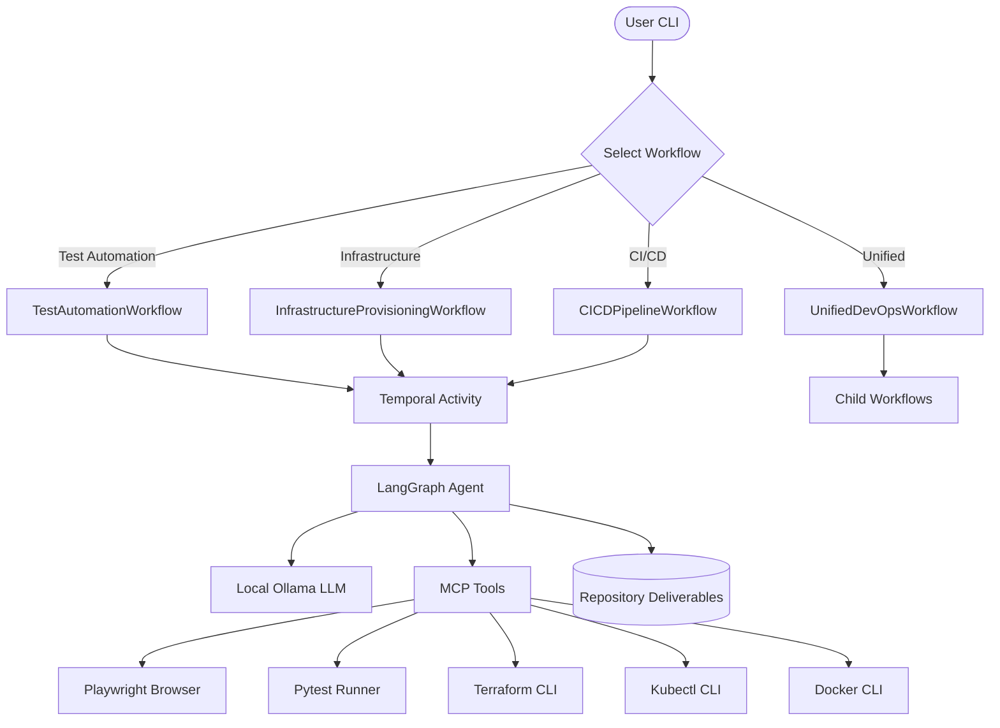

# ROUGE Architecture

ROUGE is an AI-powered DevOps and Testing Automation platform designed to generate test suites, provision infrastructure, create CI/CD pipelines, and configure observability. Built for reliability, parallel execution, and local AI reasoning.

## Core Philosophy

ROUGE transforms DevOps and testing tasks from manual, time-consuming work into automated, AI-driven workflows. It combines:
- **Temporal** for durable, fault-tolerant orchestration
- **LangGraph** for intelligent agentic reasoning
- **Ollama** for local, privacy-preserving AI inference
- **MCP** for extensible tool integration

## Core Components

### 1. Orchestration Layer (Temporal)

ROUGE uses **Temporal** to orchestrate complex, multi-phase automation pipelines. This ensures fault tolerance - if the system crashes, workflows resume exactly where they left off.

**Key Concepts:**
- **Workflows**: Multi-step processes orchestrating entire automation pipelines
  - `TestAutomationWorkflow` - End-to-end test suite generation
  - `InfrastructureProvisioningWorkflow` - Infrastructure as Code provisioning
  - `CICDPipelineWorkflow` - CI/CD pipeline creation
  - `UnifiedDevOpsWorkflow` - Complete DevOps automation

- **Activities**: Isolated, idempotent tasks executed by workflows
  - `run_agent_activity` - Execute a single AI agent
  - Agent-specific activities with configurable timeouts

- **Signals & Queries**: Real-time communication
  - `add_log` signal - Agents send real-time progress updates
  - `get_logs` query - External monitoring of workflow state

- **Parallel Execution**: Multiple agents run concurrently using `asyncio.gather()`
  - Example: UI, API, and performance test agents run in parallel
  - Maximizes throughput while maintaining coordination

### 2. Reasoning Layer (LangGraph)

Each agent is a controlled agentic loop powered by **LangGraph**, enabling sophisticated "Reason-Act" cycles.

**Agent Architecture:**
- **Graph State**: Maintains conversation history, tool calls, and context
- **LLM Backend**: Uses local **Ollama** models (Llama 3.1, Mistral, etc.)
- **Tool Integration**: Agents can call MCP tools to interact with systems
- **Iterative Refinement**: Agents loop until they complete their deliverable

**Example Agent Loop:**
1. Agent receives prompt (e.g., "Generate Playwright UI tests for this application")
2. Agent reasons about the task and decides to call tools
3. Agent executes tools (e.g., `execute_playwright_script`, `run_pytest_suite`)
4. Agent analyzes tool outputs and refines approach
5. Agent produces final deliverable (e.g., `ui_test_suite.py`)

### 3. Tooling Layer (MCP)

ROUGE implements the **Model Context Protocol (MCP)** to provide agents with capabilities spanning testing, DevOps, and infrastructure management.

**Testing Tools:**
- `execute_playwright_script` - Run browser automation
- `run_pytest_suite` - Execute test suites
- `run_api_test` - Validate REST/GraphQL APIs
- `generate_test_data` - Create test data via factories
- `capture_screenshot` - Visual testing and debugging
- `compare_screenshots` - Visual regression testing

**DevOps Infrastructure Tools:**
- `terraform_plan` / `terraform_apply` - Infrastructure as Code
- `kubectl_apply` / `kubectl_get` - Kubernetes operations
- `docker_build` / `docker_run` - Container management
- `helm_install` - Kubernetes package management

**CI/CD Tools:**
- `github_actions_create` - Generate GitHub Actions workflows
- `jenkins_create_job` - Create Jenkins pipelines

**Observability Tools:**
- `prometheus_query` - Query metrics
- `grafana_create_dashboard` - Build dashboards
- `elasticsearch_query` - Search centralized logs

**Utility Tools:**
- `save_deliverable` - Save agent outputs to repository
- `generate_totp` - 2FA code generation for testing

### 4. Agent Registry System

Agents are defined declaratively in a central registry (`session_manager.py`):

```python
AGENTS = {
    "framework-builder": AgentDefinition(
        name="framework-builder",
        display_name="Test Framework Architect",
        prerequisites=[],  # No dependencies
        prompt_template="testing/framework-design",
        deliverable_filename="framework_architecture.md",
        model_tier="large",  # Complex reasoning requires larger model
    ),
    "ui-test-scripter": AgentDefinition(
        name="ui-test-scripter",
        display_name="UI Test Automation Engineer",
        prerequisites=["framework-builder"],  # Depends on framework design
        prompt_template="testing/ui-automation",
        deliverable_filename="ui_test_suite.py",
        model_tier="medium",
    ),
    # ... 26 more agents
}
```

**Model Tiers:**
- **Large** (e.g., llama3.1:70b): Complex architectural decisions, system design
- **Medium** (e.g., llama3.1:8b): Most implementation tasks
- **Small** (e.g., llama3.1:8b): Simple reporting, formatting tasks

## Workflow Types

### 1. TestAutomationWorkflow

**Purpose:** Generate comprehensive test suites for web, API, mobile, and performance testing.

**Execution Flow:**
```
1. Framework Architecture (Sequential)
   └─ framework-builder
   ├─ test-data-factory      ┐
   └─ test-config-manager    ┘ (Parallel)

2. Test Implementation (Parallel - based on requested test_types)
   ├─ ui-test-scripter       ┐
   ├─ api-test-engineer      │
   ├─ mobile-test-engineer   │ (All run in parallel)
   ├─ performance-tester     │
   └─ accessibility-tester   ┘

3. CI Integration + Reporting (Parallel)
   ├─ ci-integrator          ┐
   └─ test-reporter          ┘
```

**Input:**
- `target_app_url` - Application to test
- `test_types` - ["ui", "api", "performance", ...]
- `framework_preference` - "playwright" | "selenium" | "cypress"
- `ci_platform` - "github-actions" | "jenkins"

**Output:**
- Executable test suite files (`.py`)
- CI/CD pipeline configuration
- Test report templates

### 2. InfrastructureProvisioningWorkflow

**Purpose:** Provision cloud infrastructure, Kubernetes clusters, and observability stacks.

**Execution Flow:**
```
1. Infrastructure Design (Sequential)
   └─ iac-engineer (Terraform/Pulumi code generation)

2. Infrastructure Implementation (Parallel)
   ├─ container-engineer     ┐
   ├─ config-automator       │ (All run in parallel)
   └─ k8s-orchestrator       ┘ (if infrastructure_type == "kubernetes")

3. Observability Setup (Parallel - based on observability_tools)
   ├─ monitoring-engineer    ┐
   ├─ log-aggregator         │ (Conditional on tools requested)
   └─ dashboard-builder      ┘
```

**Input:**
- `cloud_provider` - "aws" | "azure" | "gcp"
- `infrastructure_type` - "kubernetes" | "vm" | "serverless"
- `environment` - "dev" | "staging" | "production"
- `observability_tools` - ["prometheus", "grafana", "elk"]

**Output:**
- Infrastructure as Code files (`.tf`, `.yaml`)
- Kubernetes manifests
- Monitoring configurations

### 3. CICDPipelineWorkflow

**Purpose:** Design and implement CI/CD pipelines with deployment strategies.

**Execution Flow:**
```
1. Pipeline Design (Sequential)
   └─ pipeline-architect

2. Pipeline Implementation (Parallel)
   ├─ deployment-strategist  ┐
   ├─ artifact-manager       │ (All run in parallel)
   └─ security-scanner       ┘ (if enable_security_scanning)
```

**Input:**
- `platform` - "github-actions" | "jenkins" | "gitlab-ci"
- `deployment_strategy` - "blue-green" | "canary" | "rolling"
- `enable_security_scanning` - boolean

**Output:**
- CI/CD pipeline configuration files
- Deployment strategy manifests
- Security scan configurations

### 4. UnifiedDevOpsWorkflow

**Purpose:** Execute complete end-to-end DevOps automation (Infrastructure → CI/CD → Testing).

**Execution Flow:**
```
1. InfrastructureProvisioningWorkflow (Sequential - child workflow)
   ↓
2. CICDPipelineWorkflow (Sequential - depends on infrastructure)
   ↓
3. TestAutomationWorkflow (Sequential - depends on CI/CD)
```

**Why Sequential?**
- Testing needs CI/CD pipelines to run tests
- CI/CD needs infrastructure to deploy to
- Each phase builds on the previous

## Agent System

### Agent Phases

Agents are organized into phases for metrics aggregation and progress tracking:

**Testing Phases:**
- `test-architecture` - Framework design and configuration
- `test-implementation` - Writing test code
- `test-cicd-integration` - CI/CD pipeline integration
- `test-reporting` - Report generation and analysis

**DevOps Infrastructure Phases:**
- `infrastructure-design` - IaC design
- `infrastructure-implementation` - Resource provisioning

**DevOps CI/CD Phases:**
- `cicd-design` - Pipeline architecture
- `cicd-implementation` - Pipeline creation

**DevOps Observability Phases:**
- `observability-setup` - Monitoring and logging
- `reliability-operations` - Incident response, chaos engineering

**DevOps Security Phases:**
- `security-operations` - Security scanning, compliance

### Agent Execution

Each agent follows this lifecycle:

1. **Initialization**
   - Load agent definition from registry
   - Resolve model tier (small/medium/large)
   - Load prompt template with Jinja2 variables

2. **Execution**
   - Create Git checkpoint (for rollback)
   - Initialize LangGraph agent with MCP tools
   - Run agent loop with real-time logging
   - Collect metrics (duration, tokens, cost)

3. **Completion**
   - Validate deliverable was created
   - Commit success to Git
   - Return results to workflow

## Data Flow



## Prompt Engineering

Agents are powered by carefully crafted prompts following a consistent structure:

```
<role>
You are a [Agent Type] with expertise in [Domain]...
</role>

<objective>
Your mission is to [Task Description]...
Success criterion: [Clear success metrics]
</objective>

<scope>
@include(shared/_testing-context.txt)  # Jinja2 template includes
</scope>

<critical>
**Professional Standards**
- [Domain-specific requirements]
- [Quality gates]
</critical>

<starting_context>
- Your inputs from previous agents: [File paths]
- Dependencies: [What's already done]
</starting_context>

<tools_available>
You have access to: [List of MCP tools]
</tools_available>

<deliverable_format>
Your output must be: [Expected file format and structure]
</deliverable_format>

<best_practices>
1. [Domain best practice 1]
2. [Domain best practice 2]
...
</best_practices>
```

**Prompt Directory Structure:**
```
prompts/
├── testing/
│   ├── framework-design.txt
│   ├── ui-automation.txt
│   ├── api-testing.txt
│   └── ... (12 testing prompts)
├── devops/
│   ├── iac-design.txt
│   ├── kubernetes.txt
│   ├── pipeline-design.txt
│   └── ... (13 DevOps prompts)
└── shared/
    ├── _testing-context.txt
    ├── _devops-context.txt
    └── _best-practices.txt
```

## Parallel Execution Strategy

ROUGE maximizes throughput by running independent agents in parallel:

**Example: TestAutomationWorkflow**
```python
# Sequential: Framework must be designed first
await execute_activity(agent="framework-builder")

# Parallel: Test data and config are independent
await asyncio.gather(
    execute_activity(agent="test-data-factory"),
    execute_activity(agent="test-config-manager"),
)

# Parallel: All test types run simultaneously
test_tasks = [
    execute_activity(agent="ui-test-scripter"),
    execute_activity(agent="api-test-engineer"),
    execute_activity(agent="performance-tester"),
]
await asyncio.gather(*test_tasks)
```

**Benefits:**
- Reduces total execution time by 60-80%
- Maximizes resource utilization
- Maintains coordination through prerequisites

## Error Handling & Fault Tolerance

**Temporal Guarantees:**
- Workflows are durable - survive process crashes
- Activities are retryable - automatic retry on transient failures
- Timeouts are configurable per activity

**Agent-Level Error Handling:**
- Git checkpoints before each agent run
- Rollback on failure
- Detailed error logging
- Metrics collection even on failure

## Configuration System

**Settings (`config/parser.py`):**
```python
class RougeSettings:
    # Temporal Configuration
    temporal_address: str = "localhost:7233"
    temporal_namespace: str = "default"

    # Model Configuration (Tier-based)
    ollama_small_model: str = "llama3.1:8b"
    ollama_medium_model: str = "llama3.1:8b"
    ollama_large_model: str = "llama3.1:70b"

    # Feature Flags (Future)
    enable_testing: bool = True
    enable_devops: bool = True
```

**Distributed Configuration (YAML):**
```yaml
testing:
  framework_preference: playwright
  ci_platform: github-actions

devops:
  cloud_provider: aws
  infrastructure_type: kubernetes
  observability_tools:
    - prometheus
    - grafana
    - elk
```

## Performance Considerations

**Optimization Strategies:**
- **Model Tier Assignment**: Large models only for complex architectural decisions
- **Parallel Execution**: Independent agents run concurrently
- **Caching**: Git-based checkpointing prevents re-running successful agents
- **Timeouts**: Aggressive timeouts prevent hung agents

**Typical Execution Times:**
- TestAutomationWorkflow: 15-25 minutes
- InfrastructureProvisioningWorkflow: 20-35 minutes
- CICDPipelineWorkflow: 10-20 minutes
- UnifiedDevOpsWorkflow: 45-60 minutes

## Scalability

**Horizontal Scaling:**
- Run multiple Temporal workers across machines
- Each worker can handle different workflow types
- Temporal handles load balancing automatically

**Vertical Scaling:**
- Increase worker resources for faster agent execution
- Use more powerful Ollama models for better quality

## Future Architecture

**Planned Enhancements:**
- **Modular Tool Loading**: Enable/disable tool categories
- **Custom Agent Registry**: User-defined agents
- **Multi-Cloud Support**: Unified abstractions for AWS/Azure/GCP
- **Agent Validation**: Automated testing of generated code
- **Feedback Loops**: Agents learn from previous runs
