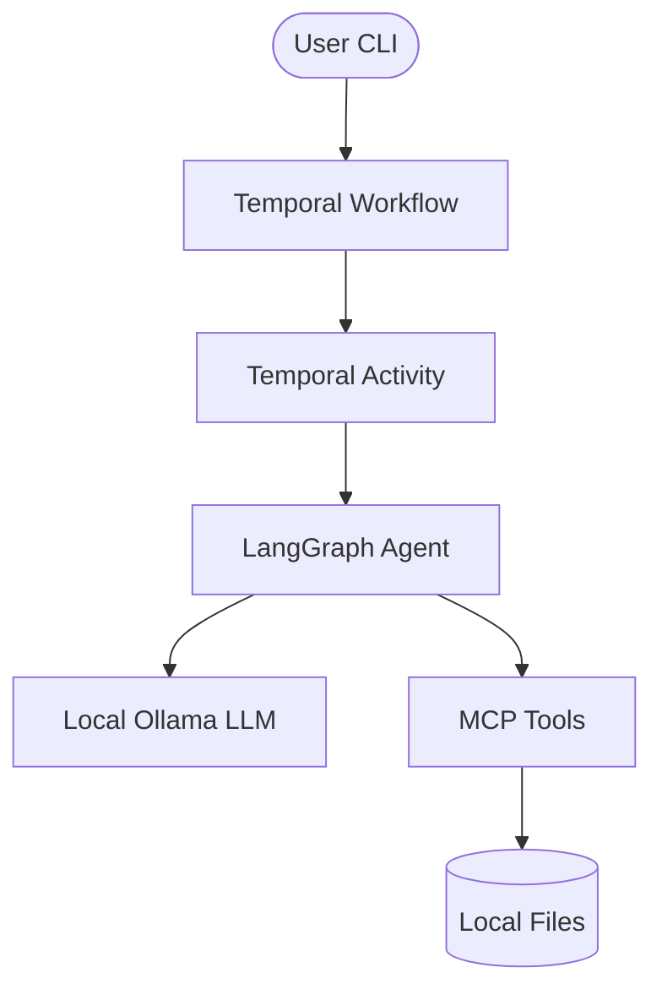

# ROUGE Architecture

ROUGE is an autonomous penetration testing framework designed to discover and exploit web vulnerabilities. It is built with a focus on durability, parallel execution, and local AI reasoning.

## Core Components

### 1. Orchestration Layer (Temporal)
ROUGE uses **Temporal** to orchestrate its multi-phase pipeline. This ensures that even if the system crashes, the pentest can resume exactly where it left off.
- **Workflows**: Multi-step processes like `RougePentestWorkflow`.
- **Activities**: Isolated, idempotent tasks like running an agent or assembling a report.

### 2. Reasoning Layer (LangGraph)
Each agent in ROUGE is a controlled agentic loop powered by **LangGraph**.
- **Graph State**: Maintains the conversation history and tool-use context.
- **LLM Backend**: Uses local **Ollama** models (e.g., Llama 3) via LangChain.

### 3. Tooling Layer (MCP)
ROUGE implements the **Model Context Protocol (MCP)** to provide agents with system-level capabilities.
- **Custom Tools**: `save_deliverable` for findings, `generate_totp` for 2FA.
- **Browser Automation**: Integrated with Playwright for dynamic web analysis.

## Pipeline Phases

1. **Pre-Recon**: Source code analysis to identify potential entry points.
2. **Recon**: Active mapping of the web application.
3. **Vulnerability Analysis**: 5 parallel pipelines targeting OWASP categories.
4. **Exploitation**: High-accuracy exploit attempts with PoC generation.
5. **Reporting**: Aggregation of results into a professional markdown report.

## Data Flow

